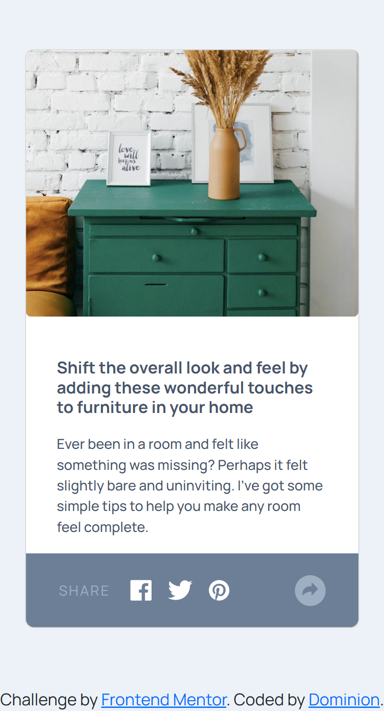

# Frontend Mentor - Article preview component solution

This is a solution to the [Article preview component challenge on Frontend Mentor](https://www.frontendmentor.io/challenges/article-preview-component-dYBN_pYFT). Frontend Mentor challenges help you improve your coding skills by building realistic projects. 

## Table of contents

- [Overview](#overview)
  - [The challenge](#the-challenge)
  - [Screenshot](#screenshot)
  - [Links](#links)
- [My process](#my-process)
  - [Built with](#built-with)
  - [What I learned](#what-i-learned)
- [Author](#author)

## Overview

### The challenge

Users should be able to:

- View the optimal layout for the component depending on their device's screen size
- See the social media share links when they click the share icon

### Screenshot

### Links

- Solution URL: [Add solution URL here](https://your-solution-url.com)
- Live Site URL: [Add live site URL here](https://your-live-site-url.com)

## My process

### Built with

- Semantic HTML5 markup
- CSS custom properties
- Flexbox
- Mobile-first workflow

### What I learned

This is one for the future tbh. 
It is definitely incomplete. Too long and unnecessarily complicated codes, buggy Js, I'm very displeased with myself and the only reason I am submitting this is cos I am tired of looking at it and I want to clear my head before coming back. 
Am I the only one that feels Bootstrap might be restrictive especially here cos we're trying to style to fit something rather than creating our own from scratch?
Nothing went well here and I am not happy but I'll take solace in the fact that this is my first Js challenge. Can only get better from here right?
I'll update this in the future when I am sure this will all look so basic to me. For now, enjoy this mess and please point me in the right direction. Thanks!

## Author

- Frontend Mentor - [@why-not-phoenix](https://www.frontendmentor.io/profile/why-not-phoenix)
- Twitter - [@dominion_onoja](https://x.com/dominion_onoja?t=RAWgmHy3YlUySDiPDnZS2g&s=09)

